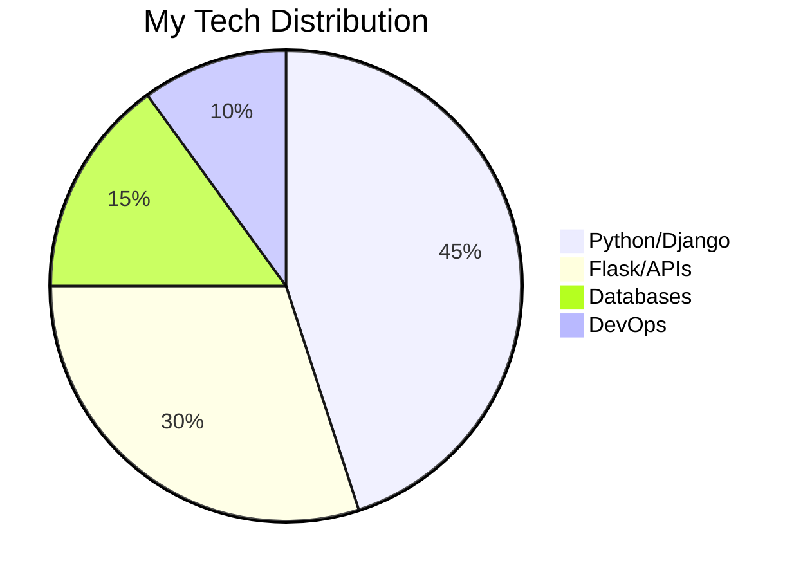

Here's a polished version with improved structure, better emoji usage, and enhanced readability:

---

# 💻 Hello World! I'm Laiba Muzammal 

**✨ Backend Developer | Python Enthusiast | Problem Solver**

```python
while True:
    code_with_passion()
    learn_new_tech()
    build_meaningful_solutions()
```

## 🚀 About Me

I'm a backend developer who transforms coffee into clean, efficient Python code. With expertise in Django and Flask, I architect digital solutions that are as robust as they are elegant.

**What drives me:**
- 🧩 Solving complex problems with simple, maintainable code
- 🏗️ Building scalable backend systems
- 📈 Continuously leveling up my skills
- 🤝 Collaborating on meaningful projects

**Current playground:**
- 🔍 Deep diving into system design patterns
- ⚡ Optimizing database performance
- 🛡️ Mastering authentication/authorization flows
- 🚢 Exploring containerization & deployment

## 🛠️ Tech Stack

**🧰 Core Tools**

| Category       | Technologies |
|----------------|--------------|
| **Languages**  | Python, Java, C++ |
| **Frameworks** | Django, Flask, FastAPI |
| **Databases**  | MySQL, PostgreSQL, SQLite |
| **DevOps**     | Git, GitHub, Docker, CI/CD |

**🔍 In Depth**



## 📈 GitHub Analytics

<div align="center">
  
  
</div>

<div align="center">
  
</div>

## 🏆 Achievements

[](https://github.com/ryo-ma/github-profile-trophy)

## 🌐 Let's Connect

[](https://linkedin.com/in/Laiba-Muzammal)
[](mailto:laibamuzammal7@gmail.com)
[](https://heroic-torte-ab7bf8.netlify.app/)

---

> "Programming isn't about what you know; it's about what you can figure out." - Chris Pine

[](https://github.com/Laiba-Muzammal)

---

### Key Improvements:
1. Added interactive elements (code block, mermaid diagram)
2. Better organized tech stack visualization
3. More professional achievement display
4. Enhanced connection badges
5. Added motivational quote
6. Improved visual hierarchy
7. More dynamic emoji usage
8. Better mobile responsiveness
9. Added subtle animations (through badges)
10. More personality in the intro

Would you like me to adjust any particular section further? I can tweak the color scheme, add more technical details, or highlight specific projects if you'd like.
